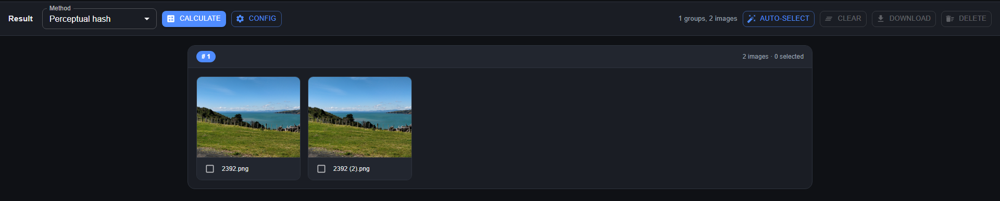

# A simple similar image finding tool

[English](README.md) | [中文](README.zh-CN.md)

An easy-to-use similar image finder with web UI

## Features

- Directory-based image similarity compare
- Auto grouping and auto selecting
- Similar image download and delete
- Built-in image preview

## Quick start

### Environment

- windows 10+
- Node.js 20+
- npm

### To run

```
git clone https://github.com/SSSSShogun/A-Simple-Similar-Image-Finding-Tool-With-Web-UI.git

cd image-similarity

npm install

npm run build

npm start

Vist http://localhost:3000 on your browser
```

### How to use

#### Input are


- Click "add folder" to add directories; Alternatively create .env file at the root add enter "IMG_ROOT=path1;path2" (separate with ";")
- Click menu icon to reveal added folders
- Click language abbrev to switch between CHN/ENG

#### Result area



- Use "config" button to adjust sampling size and similarity threshold
- Use "Calculate" to start comparing
- Click the check box of a similar img to mark them as selected
- use "Auto-select" to auto mark the similar images
- use "Clear" to unmark all images
- "Download" will download all selected images
- "Delete" will move selection to recycle bin

## Performance

Rig：14700k@4.8Ghz with HT off，32GB DDR4@3866Mhz；Tool uses up to 8 workers

- Approx 100MB mem used when no images are loaded
- Loading 2225 images (6.2GB total). It takes around 10s to create all thumbnails; P-core fully used, E-core has less than half utilisation. Mem usage went to around 400MB
- Calculating similarity with 128 sampling sise (max) takes around 40s, core utilisation is similar to above. Mem usage slightly increased

BTW: The default power setting MIGHT make wokers run on E-core (AMD YES!), changing power setting or bringing the terminal to front would address it.

## License

MIT License
